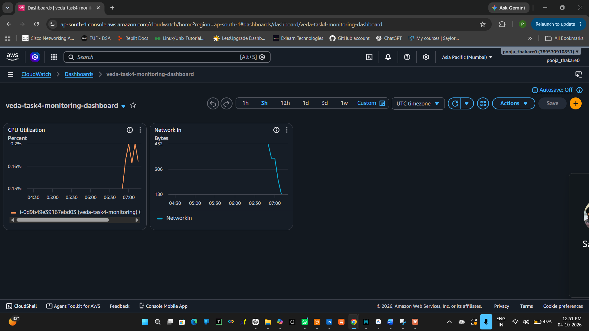
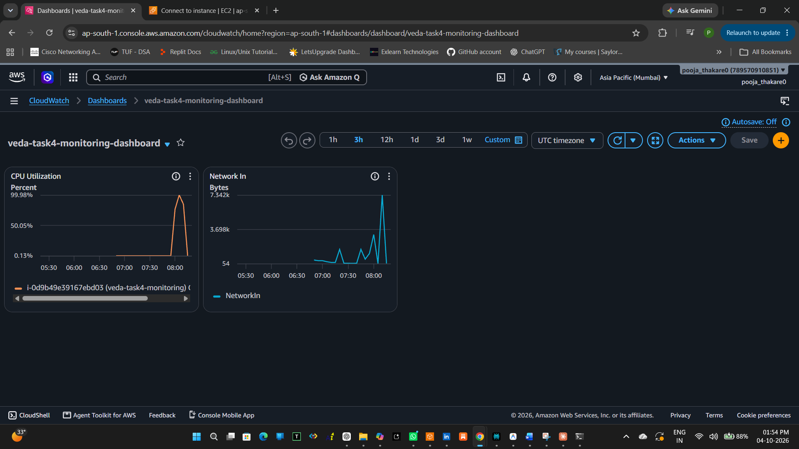
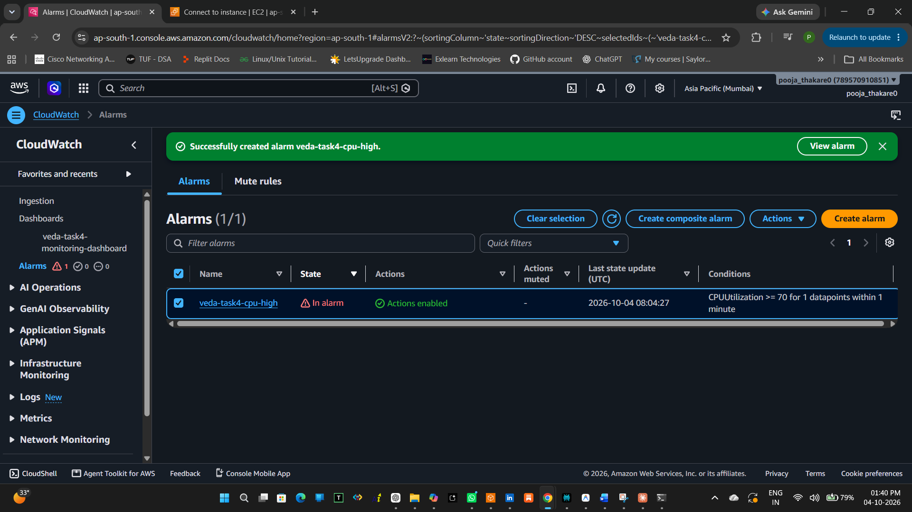
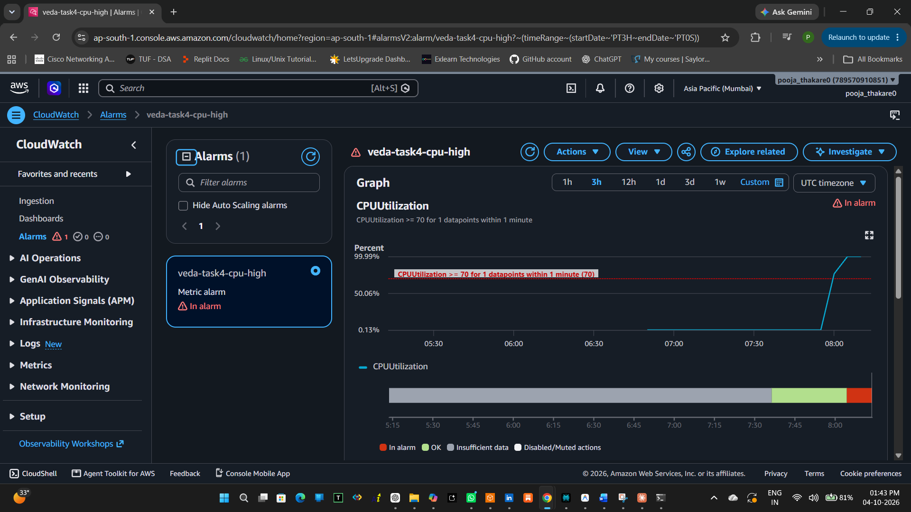
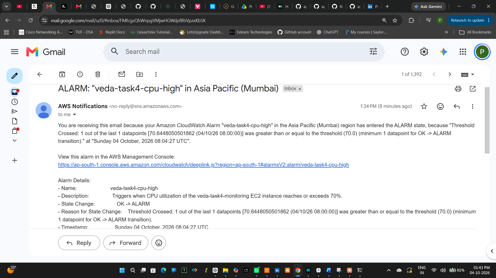
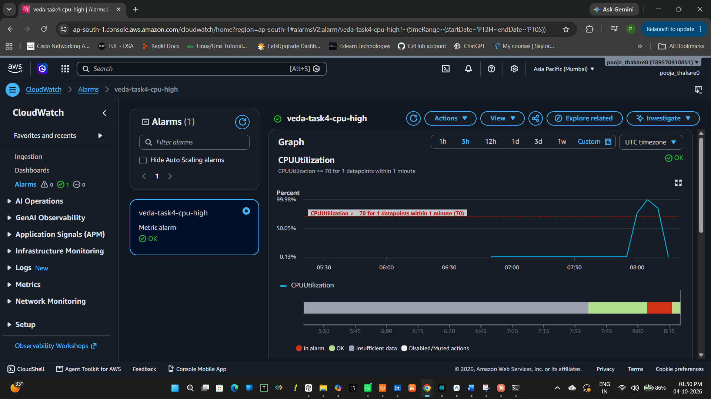

# AWS CloudWatch Monitoring and Alerting

## Cloud Computing Internship — Veda Technology

This project demonstrates a basic monitoring and alerting setup using **Amazon CloudWatch, Amazon EC2, and Amazon SNS**.

The objective was to monitor an EC2 instance, create a dashboard with multiple metrics, configure an alert for high CPU utilization, and verify that an email notification is received when the threshold is crossed.

---

## 1. Technologies Used

- Amazon EC2
- Amazon CloudWatch
- Amazon SNS
- AWS IAM
- Amazon Linux 2023
- SSH
- Windows PowerShell

---

## 2. EC2 Configuration

| Configuration | Details |
|---|---|
| Instance Name | `veda-task4-monitoring` |
| Instance Type | `t3.micro` |
| Operating System | Amazon Linux 2023 |
| AWS Region | Mumbai (`ap-south-1`) |
| Monitoring | Amazon CloudWatch |

---

## 3. CloudWatch Dashboard

A CloudWatch dashboard named **`veda-task4-monitoring-dashboard`** was created to monitor the EC2 instance.

The dashboard contains two metrics:

- CPU Utilization
- Network In

### Initial Dashboard

### Dashboard After CPU Workload

A CPU workload was intentionally generated on the EC2 instance to verify that CloudWatch could detect the change.

---

## 4. CPU Monitoring and Alert

A CloudWatch alarm named **`veda-task4-cpu-high`** was configured for the EC2 instance.

### Alarm Configuration

- Metric: `CPUUtilization`
- Statistic: Average
- Threshold: **70%**
- Evaluation: **1 datapoint**
- Notification: Amazon SNS
- SNS Topic: `veda-task4-alerts`

The threshold was selected to demonstrate a high CPU condition without creating unnecessary alerts during normal operation.

---

## 5. Alert Trigger Test

To test the alert, CPU workload was intentionally generated on the EC2 instance.

The workload caused CPU utilization to cross the configured **70% threshold**, and the CloudWatch alarm changed from **OK → ALARM**.

### Detailed Alarm Evidence

---

## 6. Email Notification

Amazon SNS was configured to send an email notification when the CloudWatch alarm entered the ALARM state.

The test successfully generated an email notification confirming that the CPU threshold had been crossed.

---

## 7. Alarm Recovery

After the CPU workload was stopped, CPU utilization returned to normal and the CloudWatch alarm changed back to the **OK** state.

This confirms that the monitoring and alerting system worked in both directions.

---

## 8. Monitoring vs Alerting

**Monitoring** continuously collects and displays system metrics such as CPU utilization and network traffic.

**Alerting** uses predefined conditions or thresholds to notify administrators when a monitored metric requires attention.

---

## 9. Avoiding Alert Fatigue

Alert fatigue can be reduced by:

- Setting meaningful thresholds.
- Avoiding unnecessary alerts.
- Using appropriate evaluation periods.
- Creating alerts only for important conditions.
- Reviewing and adjusting thresholds based on normal system behavior.

---

## 10. Important Metric for a Web Server

For a simple web server, **CPU Utilization** is an important metric because consistently high CPU usage can indicate heavy workload, insufficient resources, or application problems.

Other useful metrics include memory usage, network traffic, disk usage, and request/response metrics.

---

## 11. Rollback / Recovery Evidence

The CPU workload was stopped after testing.

The CloudWatch alarm subsequently returned from **ALARM → OK**, confirming successful recovery.

---

## 12. Conclusion

This task demonstrated how to use **Amazon CloudWatch for monitoring and Amazon SNS for alerting**. A dashboard was created with multiple metrics, a CPU threshold alarm was configured, and an email notification was successfully received when the threshold was crossed. The alarm also returned to the OK state after the workload was stopped.

---

## Screenshots

1. CloudWatch Dashboard — Initial State
2. CloudWatch Alarm — Triggered
3. SNS Email Notification
4. Detailed Alarm — Triggered
5. CloudWatch Alarm — Recovered
6. CloudWatch Dashboard — After CPU Workload
